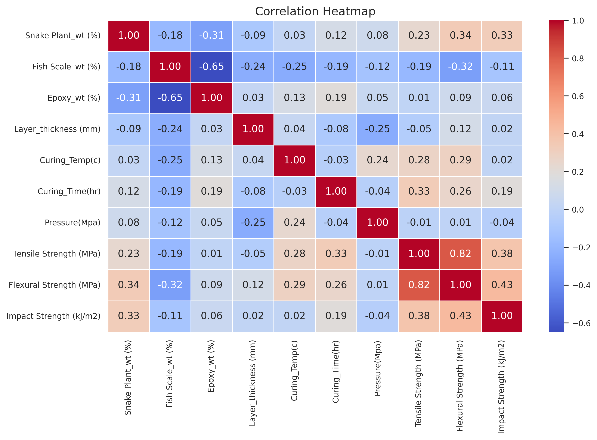
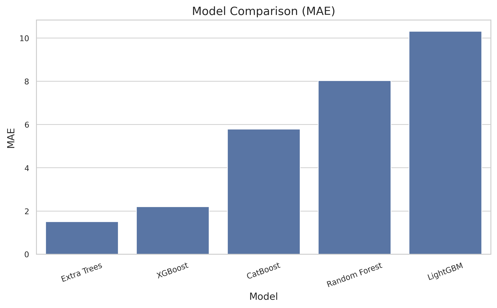
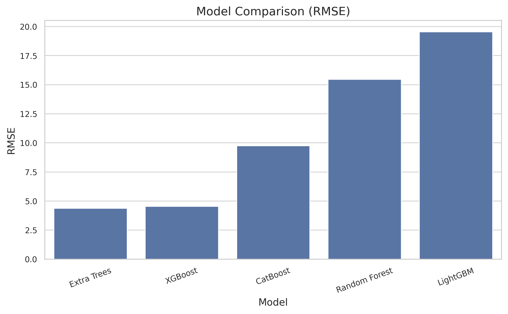
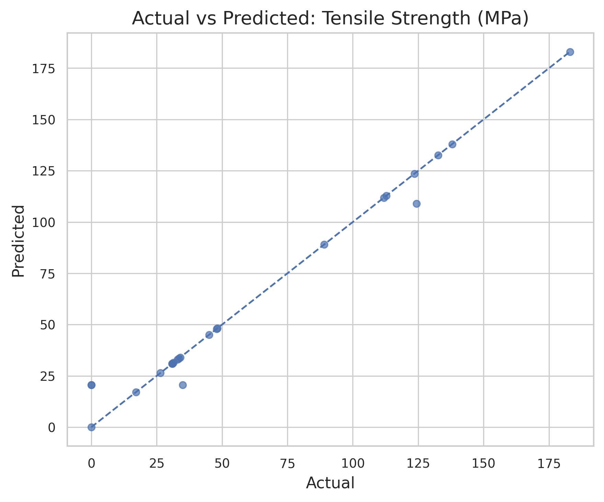
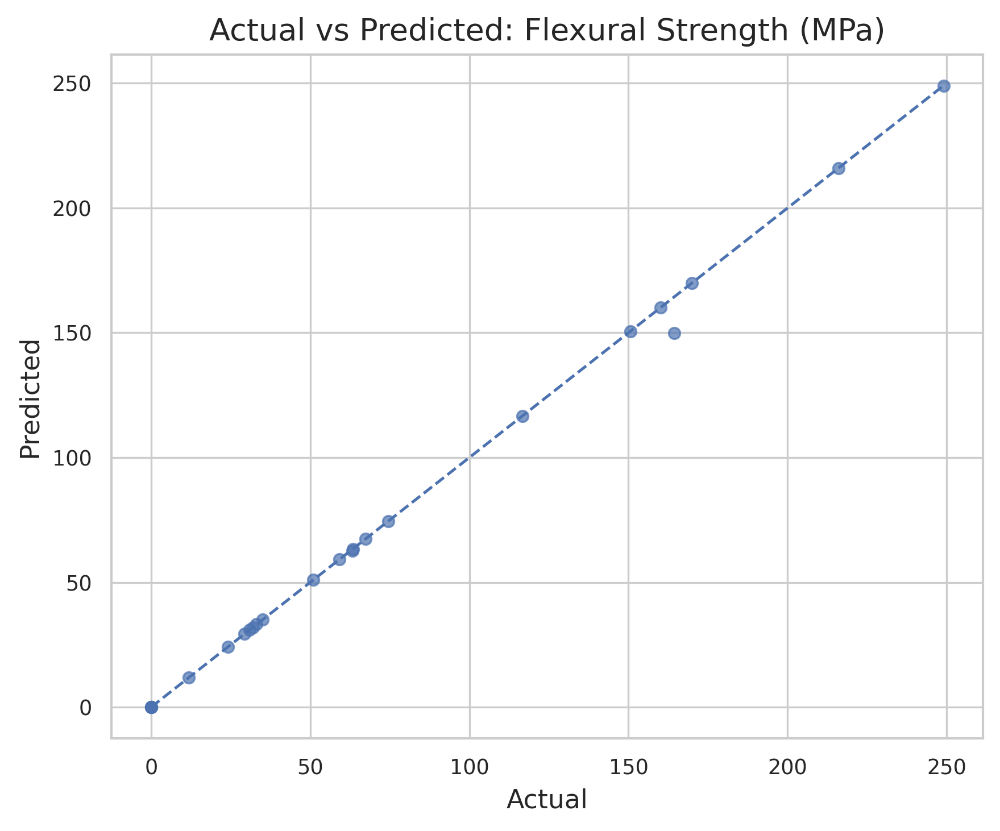
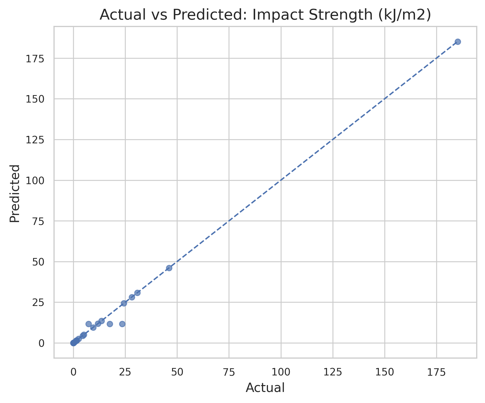
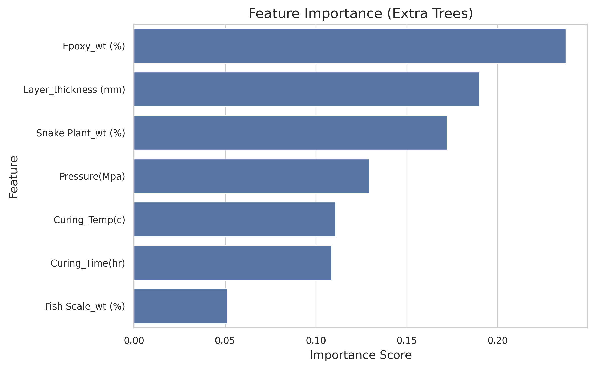
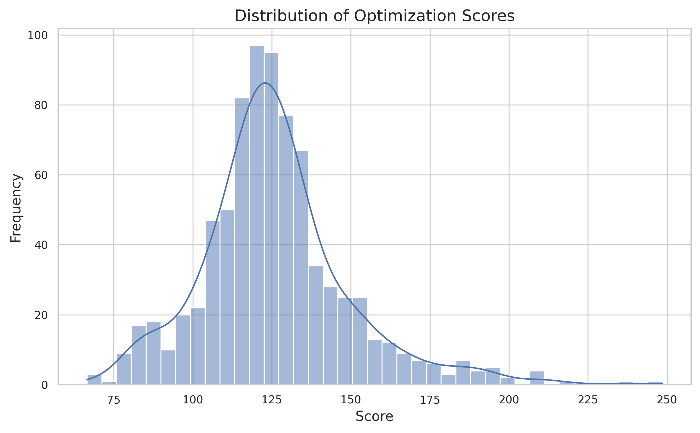

Hybrid Machine Learning-Based Prediction and Optimization of Composite Material Properties

Overview:
This project presents a hybrid machine learning approach for predicting and optimizing composite material properties using both simulated and real experimental data.

Objectives:
* Predict mechanical properties of composite materials
* Combine simulated and real datasets
* Optimize material design for best performance

Dataset:
* Simulated Data (~1000 samples)
* Real Experimental Data (~100–150 samples)
* Hybrid Dataset (combined)

Features:
* Snake Plant wt (%)
* Fish Scale wt (%)
* Epoxy wt (%)
* Layer Thickness
* Curing Temperature
* Curing Time
* Pressure

Target Variables:
* Tensile Strength
* Flexural Strength
* Impact Strength

Models Used:
* Random Forest
* Extra Trees (Best Model)
* XGBoost
* LightGBM
* CatBoost

Results:
* Extra Trees achieved best performance
* Hybrid dataset improved accuracy
* Optimization identified best material combinations

* ## 📊 Results Visualization

### 🔹 Correlation Heatmap



---

### 🔹 Model Performance

#### MAE Comparison



#### RMSE Comparison



---

### 🔹 Actual vs Predicted

#### Tensile Strength



#### Flexural Strength



#### Impact Strength



---

### 🔹 Feature Importance



---

### 🔹 Optimization Results




Project Structure:
data/
figures/
models/
results/
```

Conclusion:
This project demonstrates how hybrid machine learning improves prediction accuracy and enables efficient material optimization.

Author:
Apurbo Das
